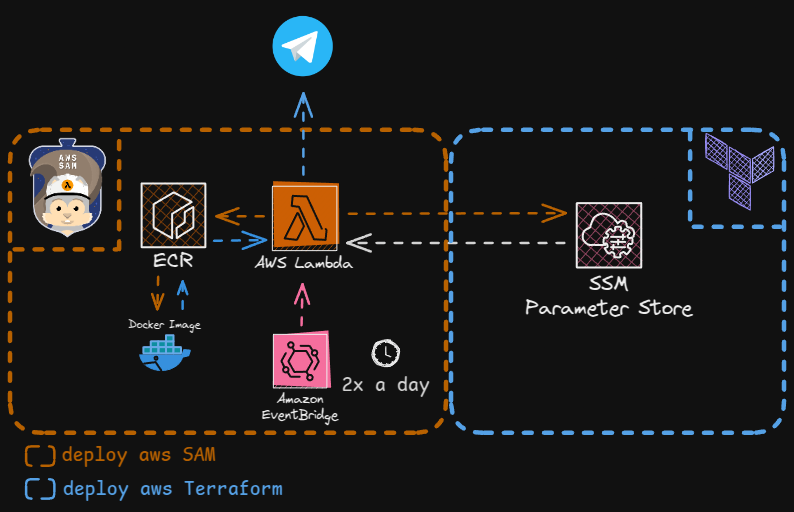

# AWS Concurso Watcher

Este projeto é uma solução serverless que utiliza uma função AWS Lambda, executada em um contêiner Docker personalizado com Selenium, para monitorar atualizações de etapas do concurso público que estou participando. Ele escaneia uma página do edital do concurso duas vezes ao dia, verifica se há novas etapas adicionadas e, quando detectado, envia uma notificação via Telegram usando um bot.

OBS: o projeto foi desenvolvido para o site do [avançasp](https://www.avancasp.org.br/)


## Funcionalidades

- **Web Scraping com Selenium**: Usa um contêiner Docker configurado com Selenium para escanear uma página web com atualizações de etapas de um concurso público.
- **Agendamento**: Executa o rastreamento automaticamente duas vezes ao dia com o AWS EventBridge (CloudWatch Events).
- **Notificações Condicionais**: Envia mensagens ao Telegram apenas quando uma nova etapa é adicionada à página.
- **Serverless com Docker**: Implementado como uma função AWS Lambda usando uma imagem Docker personalizada, eliminando a necessidade de gerenciar servidores.


## Arquitetura

1. **AWS Lambda**: Hospeda a lógica principal em um contêiner Docker com Selenium para scraping e envio de mensagens.
2. **AWS EventBridge**: Agenda a execução da Lambda duas vezes ao dia.
3. **Selenium no Docker**: Realiza o scraping da página web usando ChromeDriver dentro do contêiner.
4. **Telegram Bot**: Usa a API do Telegram para enviar mensagens com novas etapas detectadas.
5. **AWS Systems Manager (Parameter Store)** : Armazena informações sensíveis, como o Token do Telegram Bot e o Chat ID e a data da ultima atualizaçào de etapa do concurso, que é atualizada sempre que o edital posta uma nova atualização.

## Requisitos
- **AWS SAM**: [Documentação AWS SAM](https://docs.aws.amazon.com/serverless-application-model/latest/developerguide/what-is-sam.html)
- **Terraform**: [Documentação Terraform](https://www.terraform.io/docs/index.html)
- **Bot Telegram**: 
  - Criar um bot e obter o token: [Documentação Bot Telegram](https://core.telegram.org/bots#creating-a-new-bot)
- **AWS CLI**
  - Instalar e configurar o AWS CLI: [Documentação AWS CLI](https://docs.aws.amazon.com/cli/latest/userguide/cli-chap-getting-started.html)
  - usar o comando ```aws configure```
  - Insira as credenciais da AWS, a região padrão e o formato de saída quando solicitado.

### Criar o arquivo `terraform.tfvars`
No diretório `infra`, crie o arquivo `terraform.tfvars` utilizando as variáveis de exemplo fornecidas no arquivo `terraform_example.tfvars`. As variáveis incluem:
- **Token do Bot Telegram**
- **[Chat id com o bot](https://gist.github.com/nafiesl/4ad622f344cd1dc3bb1ecbe468ff9f8a#get-chat-id-for-a-private-chat)**
- **Data da ultima atualização do edital** 
## Deploy

### Provisionar a Infraestrutura
provisionar os parametros com o terraform, utilize o comando:
```bash
$ cd terraform
$ terraform apply
```
Guarde os outputs, como o `TokenBot_ARN`, `ChatID_ARN` e `LastUpdatedDate_ARN` para serem utilizados no deploy do AWS SAM.

### Deploy da parte Serverless com AWS SAM
Utilize o comando abaixo para fazer o deploy das funcionalidades serverless:
```bash
$ cd ../sam
$ sam build
$ sam deploy --guided
```
Durante o processo, forneça os parâmetros  `TokenBot_ARN`, `ChatID_ARN` e `LastUpdatedDate_ARN` e a URL do edital do concurso quando solicitado.

OBS: A principio a funçào rodara as 08:00 BRT e 18:00 BRT, para editar basta mudar os horarios em watcher/template.yaml na sessão Events.

### Testar
Para testar utilizar o comando 
```bash
$ sam remote invoke WatcherFunction
```
os logs serão enviados para o terminal ou podem ser vistos através do CloudWatchLogs.

### Limpeza
Para fazer da infraestrutura
```bash
$ cd ../sam
$ sam delete
$ cd ../terraform
$ terraform destroy
```
Para deletar o container criado pelo AWS SAM Localmente
```bash
$ docker rmi <id_do_container>
```